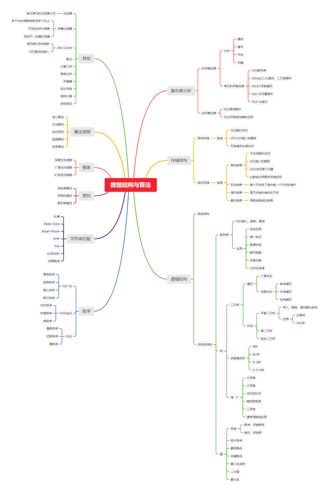

# 数据结构与算法

## 数据结构

- [x] 链表
- [x] 栈
- [ ] 树
  - [ ] 红黑树

## 算法

- [ ] 动态规划
- [ ] 查找
  - [x] 二分查找
- [ ] 搜索

## 资源

- [ ] [数据结构与算法之美](https://time.geekbang.org/column/article/178378)
- [ ] 极客时间 - 算法训练营
- [ ] [常用算法 25 讲](https://time.geekbang.org/opencourse/intro/100057601)
- [ ] [300 分钟搞定数据结构与算法](https://kaiwu.lagou.com/course/courseInfo.htm?courseId=3#/content)
- [ ] [数据结构与算法面试宝典](https://kaiwu.lagou.com/course/courseInfo.htm?courseId=185#/content)
- [ ] [数据结构与算法面试宝典](https://kaiwu.lagou.com/course/courseInfo.htm?courseId=685#/content)
- [ ] [labuladong 的算法小抄](https://labuladong.github.io/algo/)

## github 项目

- [javascript-algorithms](https://github.com/trekhleb/javascript-algorithms)
- [algorithm-visualizer](https://github.com/algorithm-visualizer/algorithm-visualizer)
- [fucking-algorithm](https://github.com/labuladong/fucking-algorithm)
- [hello-algorithm](https://github.com/geekxh/hello-algorithm)
- [数据结构与算法之美](https://github.com/wangzheng0822/algo)配套 repo

## letcode 练习

练习维度？

## 公开课

## 书籍
