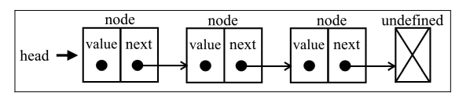

# Linked-List

## 数据结构

每个元素由一个存储元素本身的节点和一个指向下一个元素的引用（也称指针或链接）组成。


### 链表尾部添加元素

```ts
while (curr.next != null) {}
// curr为最后一项
```

## Tips

### 辅助点

- [哑节点](https://en.wikipedia.org/wiki/Linked_list#Sentinel_nodes)

### 思路

- 问题简单化
- 举例画图，辅助思考

### 链表自测

1. 如果链表为空时，代码是否能正常工作？
2. 如果链表只包含一个结点时，代码是否能正常工作？
3. 如果链表只包含两个结点时，代码是否能正常工作？
4. 代码逻辑在处理头结点和尾结点的时候，是否能正常工作？

> 代码正常运行的同时，还要去考虑边界条件或异常条件，只有这样才能写出健壮的代码

### 常见的练习题

1. 单链表反转：206
2. 链表中环的检测：141
3. 两个有序的链表合并：21
4. 删除链表倒数第 n 个结点：19
5. 求链表的中间结点：876
6. 奇偶链表：328，参考画图辅助()

### 应用题

1. 如何基于链表实现 LRU 缓存淘汰算法？
2. 一个字符串是否是回文字符串的问题(字符串使用单链表来存储的)

### 练习思路

- 实现之前不要花费太多时间思考：
  - 一是先用自己能想到的暴力方法实现试试。
  - 另外就是在一定时间内(比如半个到一个小时)实在想不到就要在网上搜搜答案。有的算法，比如链表中环的检测，的最优解法还是挺巧妙的

## APIs

## Reference

- [leetbooklinked-list](https://leetcode-cn.com/leetbook/detail/linked-list/)
- [java LinkedList](https://docs.oracle.com/javase/7/docs/api/java/util/LinkedList.html), API
- [yallist](https://github.com/isaacs/yallist), js 实现
