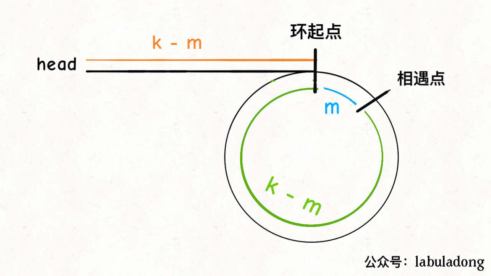

# 双指针问题

双指针问题分为两类：一类是[快慢指针]，一类是[左右指针]，前者主要解决链表中的问题，比如典型的判定链表中包含环，后者主要解决数组(或者字符串)中的问题，比如二分查找

- 快慢指针最神奇，链表操作无压力。归并排序**找中点**，**链表成环**搞判定。
- 左右指针最常见，左右两端相向行。**反转数组**要靠它，**二分搜索**是弟弟。
- 滑动窗口老猛男，**子串**问题全靠它。左右指针滑窗口，一前一后齐头进。

## 快慢指针的常见算法

### 1. 判定链表中是否含有环

[examples](./two-pointer.ts#L272)

### 2、已知链表中含有环，返回这个环的起始位置

> 画图辅助

- 第一次相遇时，假设慢指针 `slow` 走了 `k` 步，那么快指针 `fast` 一定走了 `2k` 步：
- `fast` 一定比 `slow` 多走了 `k` 步，这多走的 `k` 步其实就是 `fast` 指针在环里转圈圈，所以 `k` 的值就是环长度的「**整数倍**」
  > 我们想一想极端情况，假设环长度就是 1 
- 设相遇点距环的起点的距离为 `m`，那么环的起点距头结点 `head` 的距离为 `k - m`，也就是说如果从 `head` 前进 `k - m` 步就能到达环起点。如果从相遇点继续前进 `k - m` 步，也恰好到达环起点。你甭管 `fast` 在环里到底转了几圈，反正走 `k` 步可以到相遇点，那走 `k - m` 步一定就是走到环起点了：
- 只要我们把快慢指针中的任一个重新指向 `head`，然后两个指针同速前进，`k - m` 步后就会相遇，相遇之处就是环的起点了

## 左右指针的常用算法

左右指针在数组中实际是真两个索引值，一般初始化为: `left = 0, right = array.length - 1`

### 1. 二分查找

[examples](./binary-search.ts)

### 2. 两数之和

[examples](./binary-search.ts#L51)

- 固定一个值，遍历查找另一个值
- 使用 hashMap 存储每一个<值， 索引>
- 有序的话，可以使用左右两个指针

### 3.反转数组

- 左右指针交换

### 4.滑动窗口算法

## 滑动窗口

## Reference

- [labuladong 算法思维系列：双指针技巧](https://github.com/labuladong/fucking-algorithm/blob/master/%E7%AE%97%E6%B3%95%E6%80%9D%E7%BB%B4%E7%B3%BB%E5%88%97/%E5%8F%8C%E6%8C%87%E9%92%88%E6%8A%80%E5%B7%A7.md)
- [双指针技巧总结](https://labuladong.github.io/algo/2/19/50/)
- [Cycle detection](https://en.wikipedia.org/wiki/Cycle_detection)
- [Floyd 判圈算法](https://zh.wikipedia.org/wiki/Floyd%E5%88%A4%E5%9C%88%E7%AE%97%E6%B3%95)
