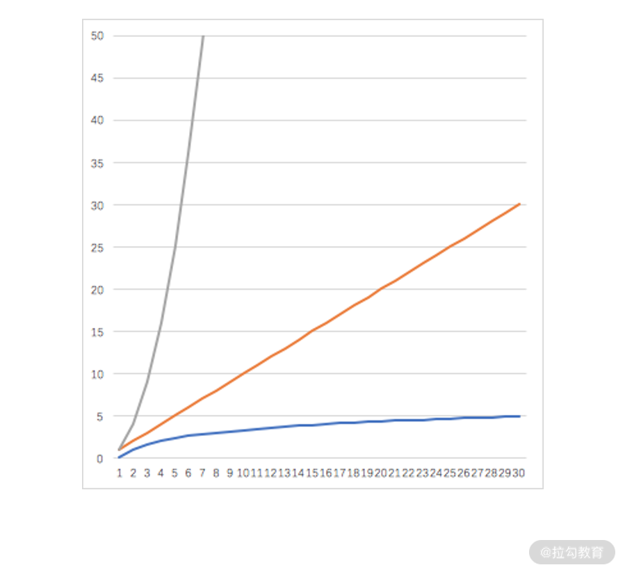

# 数学在算法与数据结构中的实战

## 复杂度：如何利用数学推导对程序进行优化

### 理解复杂度

> 大 O 表示法

复杂度是程序时间损耗和数据总量之间的变化关系，通常用 `O(f(n))` 来表示，其中 `f(n)` 就是复杂度函数。

如果程序的时间损耗和数据量的关系是 `t=c+n×b`，也就是说复杂度函数为 `f(n)=c+n×b`。复杂度通常不关注常数，因为它是个固定的时间损耗，与输入的数据总量没有任何的关系。因此，复杂度函数 `c+n×b` 可以忽略常数 `c` 和 `b`，直接缩写为 `f(n) = n`，即第一个例子的复杂度为 `O(n)`。

如果程序的时间损耗和数据量没有关系，即 `t=c`，我们依然会忽略这个常数，直接用 `O(1)` 来表示。

### 利用数学来优化时间复杂度

- 查找无序数组中仅出现一次的数字: [example](./exercise3.py)

  > 利用了异或运算的性质优化：

  - 第一，满足交换律和结合律；
  - 第二，可以把相同元素计算为 0；
  - 第三，0 异或任何数字都是其本身。

- 计算小于 n 的所有偶数和: [Example](./exercise4.py)
  > 转换为等差数列求和问题优化
- 计算不大于 n 的所有 2 的正整数次幂的数字之和: [Example](./exercise5.py)
  > 转换为等比数列求和问题优化

## 程序的循环：如何利用数学归纳法进行程序开发？

程序的结构：顺序、选择、循环这三大基本结构

**循环结构**可以用短短几行代码，执行成千上万次的运算。从计算机编程的视角来看，循环结构又有三种实现方法，分别是

- `for`循环
- `while`循环
- `do while`循环

而从数学视角来看，循环结构很像是数学归纳法。

### 从“多米诺骨牌”看循环归纳思想

> 类比

在多米诺骨牌的游戏中，游戏者手动推倒第一个骨牌，接着第一个骨牌就会撞倒第二个骨牌，第二个骨牌还会撞倒第三个骨牌。以此类推，即使骨牌数量再多，也会逐一被放倒。

我们对多米诺骨牌全部放倒的结果进行剖析，你会发现它成立的条件有以下两个：

- 第一，对于任意第 i 个骨牌而言，它的倒下能带动第 i+1 个骨牌倒下；
- 第二，有一个参与游戏的人手动推倒第一个骨牌。

只要这两个条件都满足，就能让全部的骨牌都倒下。

### 数学归纳法

最简单常见的数学归纳法是，用来证明当 n 等于任意一个自然数时某个命题成立，其证明步骤可以分下面两步：

- 第一，当 n=1 时，命题成立；
- 第二，假设对于任意一个数字 i 命题成立，可以推导出在对于 i+1，命题依然成立。

只要这两个条件都满足，命题就得证。

### 循环结构

程序中的循环结构完全可以用来表达数学归纳法，利用数学归纳法来处理的数学问题，可以被无缝迁移到一个循环结构的程序中。

1. `for`循环
2. `while`循环
3. `do while` 循环
4. 三种循环结构的区别
   
   从代码执行的顺序来看，`while` 循环与 `for` 循环都是先判断条件，再执行循环体。在极端情况下，第一次判断条件就不成功，循环体就有可能一次也不被执行；而 `do while` 循环则相反，它先执行循环体，再判断条件，_因此循环体至少会被执行一次_。

   从编码的视角来看，`while` 循环和 `do while` 循环，在条件判断的括号中只需要写循环条件；而 for 循环则循环变量赋初值、循环条件、循环变量改变方式都写在一起。

#### 三种循环实现的切换

在不考虑代码结构的美观时，这三种循环语句可以在功能上实现彼此之间的切换

### 数学归纳法与循环结构

数学归纳法和循环结构有很多相似之处，它们都是从某个起点开始，不断地重复执行某个或某组相似的动作集合。

不过，二者也有一些区别：

- **数学归纳法不关注归纳过程的结束**，它就是用一种重复动作，由有穷尽朝着无穷尽的方向去前进；
- 而循环结构作为一种程序开发逻辑，则**必须要关注循环过程的结束**，否则就会造成系统陷入死循环或死机。

## 二分法：如何利用指数爆炸优化程序

### 指数爆炸的反向应用——二分查找

[Example](./exercise6.py)

- 二分查找算法
  - 递归

### 指数爆炸和二分查找的数学基础

指数爆炸为什么那么恐怖？二分查找又为什么那么厉害？其实这都源自两个数学运算，分别是指数运算和对数运算。

1. 指数运算

   指数运算，即幂运算，写作 an，其中 a 为底数，n 为指数：

   - 当 `n` 为正数时，an 表示含义为 n 个 a 相乘的积；
   - 当 `n` 为 0 时，a0 = 1；
   - 当 `n` 为负数时，an = 1/a-n；

   除此以外，指数运算还有下面三个关键性质：

   - an \* am = an+m
   - an \* bn= (ab)n
   - (bn)m = bn\*m

2. 对数运算

对数运算是指数运算的逆运算，设幂运算 an = y，此幂运算的逆运算为 n = logay, 其中 a 是对数运算的底，而 n 就是 y 对于底数 a 的对数。

- logb(x \* y) = logbx +logby
- logbxy = y \* logbx
- logb1 = 0

- 指数函数

  对于指数函数而言，**自变量 x 的增加会让因变量 y 快速达到“爆炸”状态**。如果程序的复杂度与数据量是指数爆炸的趋势，那么随着数据量的增加，系统可能很快就会陷入瘫痪的状态。

- 对数函数

  自变量 x 的增加对因变量 y 增加的趋势影响非常小。

### 指数爆炸的正向应用——密码学

> 指数爆炸的反向应用是程序的优化，而指数爆炸的正向应用就是密码学。

## Reference

- [链接](https://kaiwu.lagou.com/course/courseInfo.htm?courseId=524)
